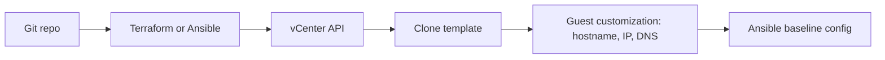

# vSphere VM Automation (Ansible + Terraform)

Automated VM provisioning on VMware vCenter from a prepared Ubuntu template.
Terraform or Ansible creates the VM; Ansible applies a baseline configuration afterwards.

> All hostnames, IPs and names in this repository are placeholders
> (`example.local`, RFC 5737 ranges `192.0.2.0/24` and `198.51.100.0/24`).
> Real values live in gitignored files created from the `*.example` templates.

## Architecture



## Features

- Clone from template with static IP, hostname, domain and DNS customization
- Ansible route: `community.vmware.vmware_guest` with Ansible Vault for the password
- Terraform route: `hashicorp/vsphere` provider, multi-VM via `for_each`
- Pre-flight check that the target IP is not already in use (Ansible)
- Baseline post-config: updates, chrony, common tools
- CI: yamllint, ansible-lint, terraform fmt/validate, gitleaks secret scan

## Prerequisites

- vCenter 7.x or 8.x and a least-privilege service account ([docs/vcenter-permissions.md](docs/vcenter-permissions.md))
- Ubuntu 22.04/24.04 template prepared per [docs/template-prep.md](docs/template-prep.md)
- Control node with Ansible >= 2.15, Python `pyvmomi`, Terraform >= 1.6

## Quick start: Ansible

```bash
cd ansible
pip install pyvmomi
ansible-galaxy collection install -r requirements.yml

cp group_vars/all/vars.yml.example group_vars/all/vars.yml      # edit values
ansible-vault create group_vars/all/vault.yml                    # add: vcenter_pass: "..."

ansible-playbook deploy-vm.yml --ask-vault-pass

cp inventory/hosts.ini.example inventory/hosts.ini               # set the VM IP and SSH user
ansible-playbook configure-vm.yml
```

## Quick start: Terraform

```bash
cd terraform
cp terraform.tfvars.example terraform.tfvars                     # edit values
export TF_VAR_vcenter_pass='...'                                 # keep the password out of files

terraform init
terraform plan
terraform apply
terraform destroy                                                # destructive: deletes the VMs
```

Then run `configure-vm.yml` against the IPs in `terraform output vm_ips`.

## Security notes

- Never commit `vault.yml`, `vars.yml`, `hosts.ini`, `*.tfvars` or `*.tfstate` (all gitignored).
- Terraform state contains the vCenter password in plaintext. Use an encrypted remote backend beyond a lab.
- `vcenter_validate_certs` / `allow_unverified_ssl` should stay secure outside a lab.
- CI only lints and validates. Deploying from CI would require a self-hosted runner inside your network.

## Troubleshooting

| Symptom | Where to look |
|---|---|
| Customization not applied | `/var/log/vmware-imc/toolsDeployPkg.log`, `/var/log/cloud-init.log` on the clone |
| Duplicate hostname or IP | Template `machine-id` not cleared; target IP already in use |
| `NoPermission` | vCenter Recent Tasks names the missing privilege |
| Module import error | `pip install pyvmomi` and reinstall the `community.vmware` collection |

## Roadmap

- [x] Ansible deploy
- [x] Terraform multi-VM with `for_each`
- [ ] Dynamic inventory (`community.vmware.vmware_vm_inventory`)
- [ ] Self-hosted runner pipeline
- [ ] Ansible roles refactor

## Acknowledgements

- [community.vmware.vmware_guest documentation](https://docs.ansible.com/ansible/latest/collections/community/vmware/vmware_guest_module.html)
- [Terraform vSphere provider documentation](https://registry.terraform.io/providers/hashicorp/vsphere/latest/docs)

## License

MIT, see [LICENSE](LICENSE).
