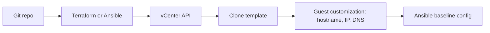

# vsphere-vm-automation


Template-based VM provisioning on VMware vCenter, implemented twice so the
approaches can be compared: **Ansible** (`community.vmware.vmware_guest`)
and **Terraform** (`hashicorp/vsphere`). Both clone a prepared Ubuntu
template with static IP, hostname, domain and DNS guest customization.
Ansible then applies a baseline configuration.

The smaller, single-purpose companion to
[labhandzone-infra](https://github.com/blow-tech/labhandzone-infra), which
provisions a full multi-VM Windows environment. This repo isolates the
vCenter clone-and-customize mechanics on Linux.

> All hostnames, IPs and names in this repository are placeholders
> (`example.local`, RFC 5737 ranges `192.0.2.0/24` and `198.51.100.0/24`).
> Real values live in gitignored files created from the `*.example` templates.

## Contents

- [Architecture](#architecture)
- [What gets built](#what-gets-built)
- [Prerequisites](#prerequisites)
- [Deployment: Ansible](#deployment-ansible)
- [Deployment: Terraform](#deployment-terraform)
- [Secrets](#secrets)
- [Continuous integration](#continuous-integration)
- [Known limitations](#known-limitations)
- [Roadmap](#roadmap)
- [License](#license)

## Architecture



## What gets built

| Tool | Result |
|---|---|
| Ansible | One VM per run, from `group_vars` values, with an IP-in-use pre-check |
| Terraform | One or more VMs from a single `vms` map using `for_each` |
| Ansible baseline | Package updates, chrony, curl, vim, htop |

```
vsphere-vm-automation/
├── ansible/
│   ├── deploy-vm.yml, configure-vm.yml, requirements.yml
│   ├── inventory/hosts.ini.example
│   └── group_vars/all/{vars,vault}.yml.example
├── terraform/
│   ├── main.tf, variables.tf, outputs.tf
│   └── terraform.tfvars.example
└── docs/
    ├── template-prep.md          # how to prepare the Ubuntu template
    └── vcenter-permissions.md    # least-privilege role
```

## Prerequisites

- vCenter 7.x or 8.x and a least-privilege service account
  ([docs/vcenter-permissions.md](docs/vcenter-permissions.md))
- An Ubuntu 22.04/24.04 template prepared per
  [docs/template-prep.md](docs/template-prep.md). The tools clone it, they
  don't build it.
- Ansible control node (Linux): `ansible-core` 2.15+, `pyvmomi`, and the
  `community.vmware` collection (`ansible/requirements.yml`)
- Terraform 1.6+

## Deployment: Ansible

```bash
cd ansible
pip install pyvmomi
ansible-galaxy collection install -r requirements.yml

cp group_vars/all/vars.yml.example group_vars/all/vars.yml   # fill in values
ansible-vault create group_vars/all/vault.yml                 # vcenter_pass: "..."

ansible-playbook deploy-vm.yml --ask-vault-pass

cp inventory/hosts.ini.example inventory/hosts.ini            # set VM IP and SSH user
ansible-playbook configure-vm.yml
```

## Deployment: Terraform

```bash
cd terraform
cp terraform.tfvars.example terraform.tfvars   # fill in values
export TF_VAR_vcenter_pass='...'               # keep the password out of files

terraform init && terraform plan
terraform apply
terraform destroy                              # destructive: deletes the VMs
```

Then run `configure-vm.yml` against the addresses in `terraform output vm_ips`.

## Secrets

Real values never live in tracked files. `vault.yml`, `vars.yml`,
`hosts.ini`, `*.tfvars` and `*.tfstate` are gitignored, and only `*.example`
placeholders are committed. Terraform state contains the vCenter password in
plaintext, so use an encrypted remote backend beyond a lab.

## Continuous integration

Every push/PR runs via GitHub Actions (`.github/workflows/lint.yml`):
- `yamllint` and `ansible-lint` across `ansible/`
- `terraform fmt -check` and `terraform validate`
- `gitleaks` secret scan over the full history

CI only lints and validates. Deploying from CI would need a self-hosted
runner inside the vCenter network, so it is deliberately not done.

## Known limitations

- **Nothing here has been run against a real vCenter end-to-end yet.** CI
  proves syntax and structure, not that a clone will customize correctly.
  Budget troubleshooting time for the first live run.
- **Guest customization is the fragile part.** Behavior depends on the
  cloud-init and open-vm-tools versions in the template. If the IP or
  hostname doesn't apply, check `/var/log/vmware-imc/toolsDeployPkg.log`
  and `/var/log/cloud-init.log` on the clone.
- **The IP-in-use check is best-effort.** It only catches hosts that answer
  ICMP from the control node; it is not an IPAM lookup.
- **One NIC, one network per VM,** and no data-disk or multi-NIC handling.
- **The vCenter privilege list is the usual clone-and-customize set,** not
  verified against every vCenter version. A `NoPermission` task error names
  the missing privilege.

## Roadmap

- [ ] Run this against a real vSphere lab and fix what the first run surfaces
- [ ] Dynamic inventory with `community.vmware.vmware_vm_inventory`
- [ ] Refactor the baseline into an Ansible role
- [ ] Packer-built template, so template prep stops being a manual step
- [ ] Self-hosted runner pipeline for real deployments

## License

MIT, see [LICENSE](LICENSE).
